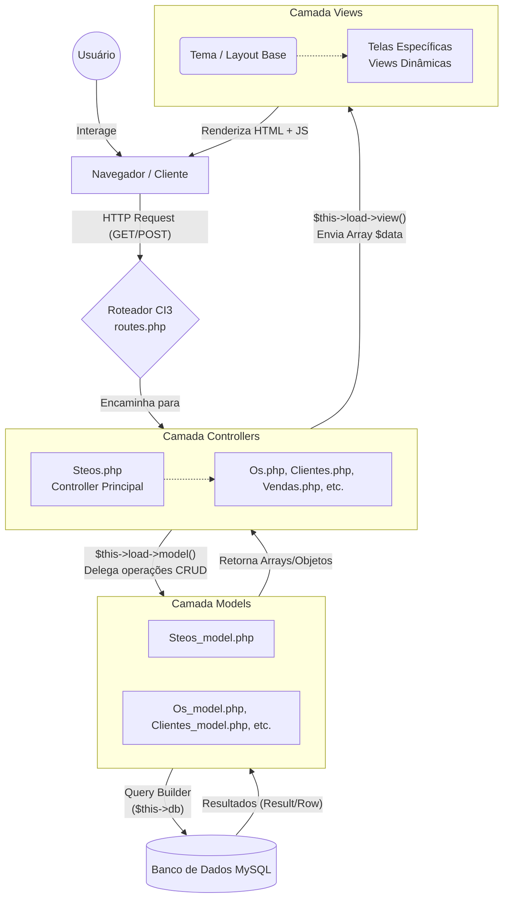

# Arquitetura Geral do Sistema Steos

Este documento ilustra a arquitetura fundamental do sistema Steos, baseado no **CodeIgniter 3**. O sistema utiliza o padrão arquitetural MVC (Model-View-Controller) fortemente acoplado.

## Diagrama MVC e Fluxo de Execução

## Descrição das Camadas
- **Controllers:** Orquestradores do fluxo. Eles recebem requisições, validam dados (usando `form_validation`), solicitam informações aos Models e processam a lógica de negócio antes de compilar os dados para a exibição nas Views.
- **Models:** Exclusivos para a manipulação do banco de dados (MySQL). Eles padronizam métodos como `add()`, `edit()`, `delete()`, e `getById()`.
- **Views:** Responsáveis pela UI e UX. Utilizam templates e recebem variáveis processadas pelos Controllers. Possuem também scripts JavaScript embarcados ou referenciados para requisições assíncronas (Ajax).
